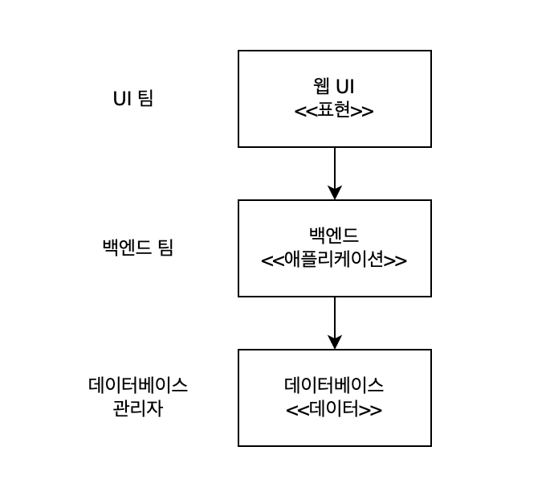
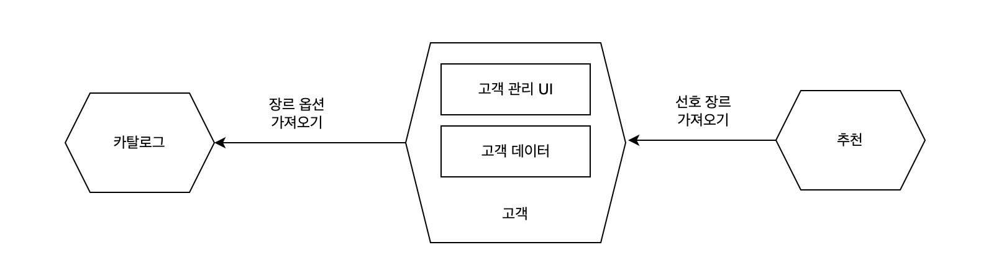

# 1장 더도 덜도 아닌 딱 마이크로서비스       

## 마이크로서비스란?
비즈니스 도메인을 중심으로 모델링된 독립적으로 배포 가능한 서비스다.     
마이크로서비스는 네트워크를 통해 서로 통신하며, 마이크로서비스 아키텍처는 여러 선택지를 제공한다.   
→ 마이크로서비스 아키텍처는 여러 협업 마이크로서비스를 기반으로 한다.       

* 독립적인 배포가 핵심이지만, SOA(서비스 지향 아키텍처)의 한 유형   
* 기술에 중립적이라는 장점이 있음 
* 기술 관점에서 하나 이상의 네트워크 종단점을 통해 캡슐화되는 비즈니스 기능을 외부에 공개 
    - 네트워크를 통해 통신: 분산 시스템이라는 형태를 구성   
* 잘 정의된 인터페이스를 통해, 데이터베이스를 캡슐화하고 데이터를 외부에 공개
    - 데이터 저장 및 검색을 캡슐화, 데이터베이스는 서비스 경계 내부에 숨겨져 있다.   

<br />

### 독립적인 배포 가능성
독립적인 배포 가능성이란 다른 서비스를 활용하지 않고서 마이크로서비스에 변경을 가하는 방식으로 서비스 환경에 배포할 수 있다는 개념이다.   

독립적인 배포를 위해서는 서비스가 느슨하게 결합되어 있음을 보장해야 한다.   
즉 다른 서비스를 변경하지 않고도 특정 서비스를 변경할 수 있는 능력을 갖출 필요가 있다.   
→ 서비스가 명시적이고 잘 정의되며 안정적인 계약이 필요함을 의미  
이를 어렵게 하는 가장 큰 부분이 데이터베이스 공유이다.  

<br />

### 비즈니스 도메인을 중심으로 하는 모델링   
프로세스 경계를 넘어서는 변경에는 비용이 많이 든다.

가상의 도메인과 회사를 사용해 특정 개념을 알아보자.  

```
회사: CD 판매가 주력 분야임에도 오늘날 가까스로 살아남은 대규모 다국적기업인 '뮤직'이라는 이름의 음반사         
```


다음 그림에서 웹 기반 사용자 인터페이스, 모놀리스 백엔드 형태의 비즈니스 로직 계층, 전통적인 데이터베이스 형태의 데이터 저장소 등 간단한 3계층 아키텍처를 볼 수 있다.   
각 계층은 각기 다른 팀이 소유한다.





<br />

### 기능 변경: 선호하는 음악 장르 지정 기능 추가 
* 장르 선택을 위한 UI 
* 장르를 UI에 노출하고 값을 변경할 수 있는 백엔드 
* 변경을 수용하는 데이터베이스 

위 시스템에서 이런 변경사항은 각 팀에서 관리하고, 올바른 순서로 배포해야 한다.  
<br />

```text
- 훨씬 더 빠른 소프트웨어 출시를 원한다. 
- 업무 이관과 사일로 현상을 줄이길 원한다. 
```

> 사일로 현상이란?     
> 사일로 효과(Silo effect)란 회사 내부의 부서들이 다른 부서와 높은 칸막이를 형성하고   
> 내부의 이익만을 추구하는 현상을 의미한다.  

<br />  


### 3계층 아키텍처의 기능 변경  
* 기능 변경은 주로 비즈니스 기능의 변경에 초점을 맞춘다.   
* 3계층 아키텍처는 비즈니스 기능이 3개 계층으로 분산되어 있다.    
  → 기능 변경이 여러 계층에 걸쳐 있을 가능성이 높다.     
* 기술 관점: 응집력이 높다. 
* 비즈니스 관점: 응집력이 낮다. 

<br />
 
### 쉽게 변경하고 싶다면?
* 코드를 그룹화하는 방식을 바꿔야 한다. 
* 기술보다는 비즈니스 기능의 응집력을 선택할 필요가 있다. 

<br />

### 대안 아키텍처



위 대안 아키텍처는 정보를 수정할 수 있도록 고객에게 UI를 외부에 공개하는 전용 고객 서비스가 있으며, 고객 상태도 이 서비스에 저장된다.    
선호 장르의 선택은 **특정 고객과 연관**되므로, 이러한 변경은 더욱 **지역화**된다.  


<br />


### 데이터 소유권 문제 
마이크로서비스는 데이터베이스를 공유해서는 안 된다는 생각 때문에 곤란한 경우가 많다.   
어떤 서비스에서 다른 서비스가 보유한 데이터에 접근하고 싶다면 데이터를 보유한 서비스를 찾아서 해당 데이터를 요청해야 마땅하다.    
해당 서비스는 무엇을 공개하고 숨길지 결정할 수 있다.   


