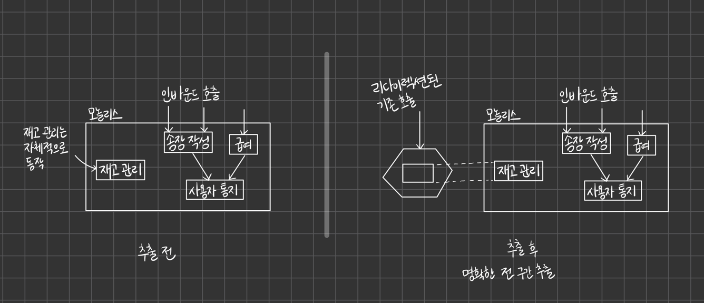

# 모놀리스 분할 

## 1. 모놀리스를 그대로 둘 것인가, 바꿀 것인가?  
마이그레이션에서 고려할 첫 번째 사항 중 하나는 기존 모놀리스를 변경할 계획이 있는지 여부다.

<br />

#### 변경할 수 없는 제약사항에 놓인 경우    
* 소스 코드를 제공하지 않는 제조사가 만든 제품을 사용할 경우   
* 기존 시스템이 더 이상 보유하지 않은 기술로 작성된 경우     
* 현재 모놀리스가 너무 견고해 변경 비용이 많이 드는 경우      


<br />
<br />

### 1-1) 잘라내기, 복사 or 재구현?
기존 모놀리스의 코드에 접근할 수 있다 하더라도 새로운 마이크로서비스로 마이그레이션을 시작할 경우,   
기존 코드로 수행해야 하는 작업이 항상 명확한 것은 아니다.   

기존의 모놀리스 코드베이스를 충분히 제대로 리팩토링하면, 코드 자체를 이동할 때 상당한 시간을 절약할 수도 있다.   
<br />  


#### 핵심   
코드를 **복사하기**를 원하지만, 최소한 당장은 모놀리스 자체에서 이 기능을 제거하고 싶지는 않다는 점이다. 

일정기간 동안 모놀리스의 기능을 유지하면 우리에게 다음과 같은 더 많은 선택지를 제공한다.     
* 복원 지점을 확보할 수 있다.   
* 두 가지 구현을 병행 실행하는 기회를 얻을 수 있다.  
* 마이그레이션이 성공적으로 완료된 후 모놀리스에서 기능을 제거할 수 있다. 


<br />   

### 1-2) 모놀리스 리팩토링   
새로운 마이크로서비스를 위해 모놀리스에서 가져온 기존 코드를 재사용하는 과정에서 가장 큰 벽은   
기존 코드베이스가 전통적으로 비즈니스 도메인 개념을 중심으로 구성되지 않았다는 문제였다.   

=> 이는 특히 비즈니스 도메인 기능을 이동하려 할 때 기존 코드베이스가 해당 분류와 일치하지 않기 때문에 난관이 될 수 있다.  

<br />


비즈니스 영역의 경계를 따라가며 기존 모놀리스를 재구성하는 과정이라면,     
(마이클의 봉합(seam)의 개념을 권장한다.)   

```text
(1) 기존 동작 방식을 수정하지 않고서도 코드 변경이 가능한 장소를 정의 
(2) 새로운 구현 작업을 수행하여, 변경이 이뤄진 후 교체한다. 
```

> 봉합(Seams)은 프로그램 안에서 동작은 변화시킬 수 있는 위치를 말한다.    
> 이때 동작을 변화시키기 위해 코드를 편집할 필요는 없다.     
> 모든 봉합은 하나의 가능 지점(enable point)를 가지고 이 지점은 하나의 동작이나 다른 동작을 사용하기 위한 결정을 내리는 지점이다.   


<br />

### 1-3) 모듈식 모놀리스? 
기존 코드베이스를 이해하기 시작했다면 새로 식별된 봉합(seam)을 가져와서     
모놀리스를 모듈식 모놀리스로 만들기 위해 별도 모듈로 추출하는 단계를 고려하자.    

독립적으로 개발 가능한 모듈로 모놀리스를 분해하면 마이코서비스 아키텍처의 많은 문제를 극복하면서 다양한 이점을 얻을 수 있으며,   
많은 조직에 해법이 될 수도 있다.   

<br />

### 1-4) 점진적인 재작성 
때때로 팀들은 이와 같은 기존 코드 수정만으로 충분한 성과를 거두기에 애당초 마이크로서비스가 필요하지 않다는 사실을 깨닫게 된다.   

그러나 실제로 마이크로서비스 전환에 앞서 모놀리스 리팩토링부터 먼저 진행하는 팀은 드물다는 사실을 받아들여야 한다.
그 대신, 그 팀들이 새로 만들어진 마이크로서비스의 책임을 확인하고 나면, 해당 기능을 완전히 새롭게 구현하는 관례가 더 일반적인 것 같다.   

기능을 재구현하기 시작하는 경우, 완전히 새로 고쳐 쓰는 빅뱅에 수반된 문제를 반복할 위험에 처하진 않을까?   
핵심은 한 번에 작은 기능만 재작성하고 이렇게 재작성된 기능을 고객에게 정기적으로 출시하는 방법이다.   


<br />
<br />

## 2. 마이그레이션 패턴 
패턴이 '언제 어디서나 좋은' 개념은 아니라는 사실을 기억하자.   

<br />

### 2-1) 패턴: 교살자 무화과 애플리케이션 
시스템을 재작성할 때 자주 사용하는 기법이다.    

> 교살자 무화과     
> 마틴 파울러가 숙주 나무의 위쪽 가지에 씨앗을 뿌리는 무화과 나무를 보고 영감을 얻음.  

기존 나무는 처음에 새로운 무화과 나무의 지지대가 되다가 마지막 단계에 이르면 썩어서 죽어버리고,   
그 자리에는 이제 스스로 생존이 가능해진 무화과 나무만 남게 된다.  


초기에 기존 시스템이 새로운 시스템을 지원하고, 새로운 시스템이 기존 시스템을 감싸는 형태로 병행된다.   
새로운 시스템은 성장할 시간을 얻고, 잠재적으로 기존 시스템을 완전히 대체할 수 있게 된다.   

<br />

### 2-2) 작동 원리 
교살자 무화과 패턴은 일반적으로 하나의 모놀리스 시스템에서 다른 모놀리스 시스템으로 마이그레이션하는 과정에 사용되어왔지만,   
지금은 모놀리스 -> 마이크로서비스 마이그레이션하는 과정을 살펴보자. 

(모놀리스에서 코드를 복사하거나 해당 기능을 재구현하는 작업이 포함될 수 있음)


교살자 무화과 패턴의 구현은 위 그림처럼 3단계에 의존한다.    

새 기능을 아직 운영 환경에서 사용하지 않는다는 사실을 알고 있으므로, 안전하게 변경사항을 운영 환경에 추가할 수 있으며,   
이는 새로운 서비스의 배포와 관리 측면에서 만족스러운 결과를 낳는다.   

새 서비스가 모놀리스와 동일한 기능을 구현하면, 병행 실행과 같은 패턴을 사용해 새 기능이 의도한 대로 작동하고 있음을 확신할 수 있다.   

<br />  

> 배포 개념을 릴리스에서 분리하는 것이 중요하다.   
> 특정 환경에 소프트웨어가 배포되었다고 해서 고객이 실제로 사용하는 것은 아니다.   
> 교살자 무화과, 병행 실행, 카나리아 릴리스 등의 패턴은 배포와 릴리스가 분리된 활동이라는 사실을 잘 이용하는 패턴들이다.   

<br />


이 교살자 애플리케이션 접근 방식의 핵심은 새로운 기능을 신규 시스템으로 점진적으로 마이그레이션할 수 있을 뿐만 아니라 필요한 경우 변경사항을 매우 쉽게 되돌릴 수 있다는 점이다.     

<br />

### 2-3) 적용 대상 
교살자 무화과 패턴을 사용하면 기존 시스템을 건드리거나 변경하지 않고도 새로운 서비스 아키텍처로 기능을 이동할 수 있다.    

<br />     

#### 장점 
* 경합을 줄이는 데 도움이 된다.   
* 다른 사람들이 기존 모놀리스 자체를 대상으로 작업할 경우에 유리하다.  



<br />

이와 같이 명확하게 전 구간 추출을 수행하려면 전반적인 과정을 단순화하기 위해 더 큰 기능을 추출하게 될 때가 있다.   
이는 까다로운 균형 조정 작업이 될 수 있다.   

```text
더 큰 기능 조각을 추출 => 더 많은 작업 수행 => 통합 문제 중 일부는 단순해질 수 있음 
```

소규모로 시작하고 싶다면 '얕은 추출'을 고려해야 할지도 모른다.   
예제에서 모놀리스 내부에 남아 있는 다른 기능 (= 사용자 통지 기능) 을 사용함에도 불구하고, 급여기능을 추출하고 있다.  


