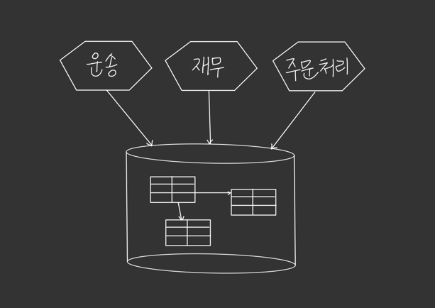
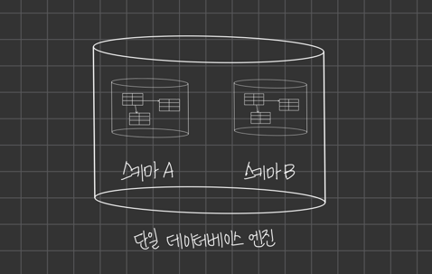
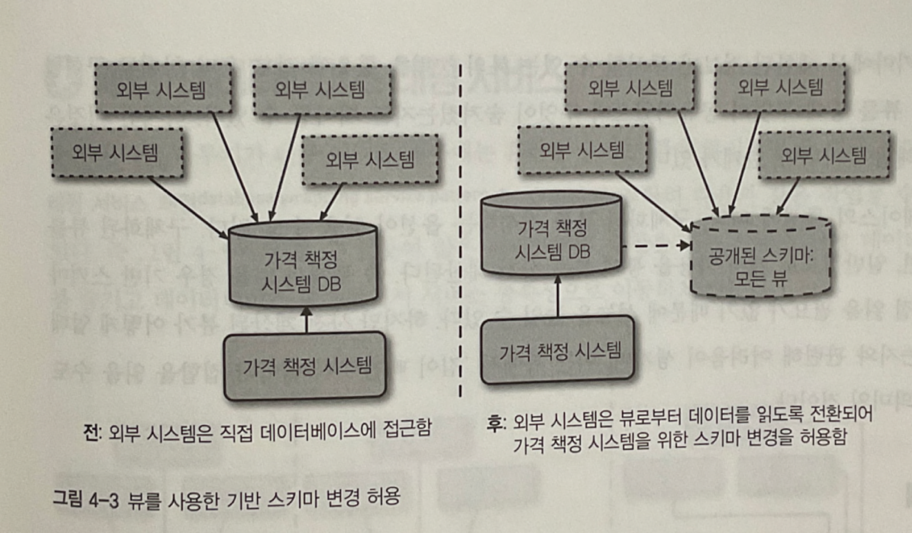

# 데이터베이스 분해 

* 데이터베이스를 분리하는 전환 과정에서 고려해야 할 점 
    - 데이터 동기화 
    - 논리적 스키마와 물리적 스키마의 분해
    - 트랜잭션 무결성 
    - 조인 (join)
    - 대기시간

<br />

# 패턴: 공유 데이터베이스 
도메인 결합도, 시간적 결합도, 구현 결합도의 3가지 측면에서 결합도를 생각할 수 있다.    




위 그림처럼 데이터베이스를 공유하는 개발자들은 여러 스키마에 흩어져 있기 때문에 가장 큰 비중을 차지하는 결합도는 구현 결합도다.   

<br />

### 여러 서비스 간 단일 데이터베이스 공유 방식 단점 
우리가 무엇을 공유하고 무엇을 숨길지 결정하는 기회를 부정하는 (즉 정보은닉을 무시하는) 것이다.   

이는 스키마의 어떤 부분을 안전하게 변경할 수 있는지 이해하기 어려울 수 있다는 뜻이다.  

외부 관계자가 데이터베이스에 접근할 수 있는지 아는 것과 스키마의 어느 부분을 사용하는지 모른다는 것은 별개의 문제다.    

<br />

누가 데이터를 '제어' 하는지 명확하지 않다는 문제도 있다.     
해당 데이터를 조작하는 비즈니스 로직이 흩어져 있다. → **응집력이 부족함**  

> 마이크로서비스를 동작과 상태의 조합으로 간주할 때, MSA는 하나 이상의 상태 머신을 캡슐화한다.    

그림처럼 3개의 서비스가 주문 정보를 직접 변경할 수 있는 경우, **서비스 간에 동작 방식이 일치하지 않는다면?**  


<br />   
<br /> 

### 패턴 다루기   
MSA에서 자체적인 데이터를 소유할 수 있도록 데이터베이스를 분리하는 방식이 거의 선호된다.   

**분리가 불가능하다면?**  

```text
1. 데이터베이스 뷰 패턴 
2. 데이터베이스 래핑 서비스 패턴
```

<br />
<br />

### 적용 대상 
데이터베이스를 직접 공유하는 것이 적합한 MSA 예시 

```text
1) 읽기 전용 정적 참조 데이터를 고려할 경우 
2) 서비스가 여러 컨슈머를 다루기 위해 설계되고 관리되는 종단점으로서 데이터베이스를 직접 외부에 공개하는 경우 
```

이상적으로 우리는 새 서비스에 각기 독립적인 스키마가 존재하기를 바란다.   
그러나 기존 모놀리스 시스템은 스키마가 독립적으로 나뉘어 있지 않다.   

<br />
<br />

### 스키마 vs 데이터베이스 
* 스키마   
데이터를 담는 논리적으로 분리된 테이블 집합 


* 데이터베이스 
스키마나 데이터베이스 엔진을 지칭




<br />
<br />

# 패턴: 데이터베이스 뷰 
여러 서비스를 위한 단일 데이터 소스를 원하는 상황에서는 뷰(view)를 사용해 결합도와 관련된 문제를 완화할 수 있다.     
뷰를 사용하면 기반 스키마에서 제한적으로 투사한 (projection) 형태의 스키마를 서비스에 제공할 수 있다.     
➡️ 투사 기법을 통해 데이터를 제한 > 정보를 은닉할 수 있다.     

<br />
<br />

### 공개된 계약으로서 데이터베이스 

**상황)**  

```text
DB에 수행되는 쓰기 작업이 병목 형상임을 확인
스키마를 재구성하면 쓰기 성능을 대폭 향상 시킬 수 있다. 

현재 제어권 밖에 있는 많은 애플리케이션이 읽기 권한을 갖고 있고, 
일부 애플리케이션은 읽기/쓰기 접근 권한을 갖고 있다. 

그러나 누구인지 개별 파악을 불가능함.
```


<br />
<br />

### 표현할 뷰  
일단 외부 시스템이 우리 스키마에 쓰기 작업을 하는 상황을 해결하자.   
➡️ 클라이언트에게 기존 스키마처럼 보이는 전용 스키마 호스팅 뷰를 작성해서 해당 스키마를 가리키게 한다.   




클라이언트가 뷰를 바라보는 동안 우리가 만든 자체 스키마를 변경할 수 있다.   

<br />

뷰를 훨씬 단순하게 사용하면 외부 사용자에게 보이고 싶지 않은 일부 정보도 숨길 수 있다.  


