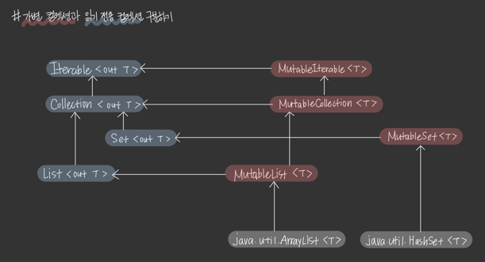

# 1장 안정성   
왜 기업에서 코틀린을 사용하려고 할까?  
그 이유는 코틀린의 **안정성(safety)**이다.  

코틀린은 다양한 설계 지원을 통해서 애플리케이션의 잠재적인 오류를 줄여준다.   
크래시(crash)가 적으면 사용자와 개발자 모두에게 좋고, 상당한 비즈니스 가치가 제공된다.   

코틀린은 정말 안전한 언어지만, 정말로 안전하게 사용하려면 개발자가 뒷받침을 해야 한다.   

1장의 목적은 '오류가 덜 발생하는 코드를 만드는 것' 이다.   

<br />
<br />

# item1 가변성을 제한하라     

* 코틀린은 모듈로 프로그램을 설계한다.   
* 모듈은 클래스, 객체, 함수, 타입 별칭, 탑레벨 프로퍼티 등 다양한 요소로 구성된다.   
* 요소 중 일부는 상태를 가질 수 있다. 
* 예) 읽고 쓸 수 있는 프로퍼티 `var`를 제공하거나, mutable 객체를 사용하면 상태를 가질 수 있다. 

```kotlin
var a = 10 
var list: MutableList<Int> = mutableListOf()
```

이처럼 요소가 상태를 갖는 경우,   
해당 요소의 동작은 사용 방법뿐만 아니라 그 이력(history)에도 의존하게 된다.   

<br />  

### BankAccount.kt  
BankAccount 에는 계좌에 돈이 얼마나 있는지 나타내는 상태가 있다.     


```kotlin
class BankAccount {
	var balance = 0.0
	private set

	fun deposit(depositAmount: Double) {
		balance += depositAmount
	}
	
	@Throws(InsufficientFunds::class)
	fun withdraw(withdrawAmount: Double) {
		if (balance < withdrawAmount) {
			throw InsufficientFunds()
		}
		balance -= withdrawAmount
	}
}

class InsufficientFunds : Exception()
val account = BankAccount()
println(account.balance) // 0.0
account.deposit(100.0)
println(account.balance) // 100.0
account.deposit(50.0)
println(account.balance) // 50.0
```


이처럼 상태를 갖게 하는 것은 양날의 검이다.   
시간의 변화에 따라 변하는 요소를 표현할 수 있는 것은 유용하지만, 상태를 적절하게 관리하는 것이 생각보다 어렵다.  
<br />  

```text
1. 프로그램을 이해하고 디버그하기 힘들어진다. 
2. 가변성이 있으면, 코드의 실행을 추론하기 어려워진다. 
3. 멀티스레드 프로그램일 때는 적절한 동기화가 필요하다. 
4. 테스트가 어렵다.  
5. 상태 변경이 일어날 때, 이러한 변경을 다른 부분에 알려야 하는 경우가 있다. 
```

<br />

가변성은 생각보다 단점이 많다.   
시스템의 상태를 나타내기 위한 중요한 방법이기 때문에 변경이 일어나는 부분을 신중하고 확실하게 결정하고 사용해야 한다.   

<br />
<br />

### 코틀린에서 가변성 제한하기 
코틀린은 가변성을 제한할 수 있게 설계되어 있다.   
immutable(불변) 객체를 만들거나, 프로퍼티를 변경할 수 없게 막는 것이 쉽다.   

* 읽기 전용 프로퍼티 (val)
* 가변 컬력션과 읽기 전용 컬렉션 구분하기 
* 데이터 클래스 copy 

<br />

#### 방법1) 읽기 전용 프로퍼티(val)
코틀린은 val을 사용해 읽기 전용 프로퍼티를 만들 수 있다.   
값(value) 처럼 동작하고 일반적인 방법으로는 값이 변하지 않는다.   

```kotlin
val a = 10
a = 20 // 오류
```

> 주의❗️   
> 읽기 전용 프로퍼티가 완전히 변경 불가능한 것은 아니다.     
> 읽기 전용 프로퍼티가 mutable 객체를 담고 있다면, 내부적으로 변할 수 있다.     

```kotlin
val list = mutableListOf(1,2,3)
list.add(4)

print(list) // [1, 2, 3, 4]
```

<br />

읽기 전용 프로퍼티는 다른 프로퍼티를 활용하는 사용자 정의 getter 로 정의할 수 있다.   
var 프로퍼티를 사용하는 val 프로퍼티는 var 프로퍼티가 변할 때 변할 수 있다. 

```kotlin
var name: String = "Hanna"
var surname: String = "Park"
val fulName
    get() = "$name $surname"
    
fun main() {
    println(fulName) // Hanna Park
    name = "Hyerin"
    println(fullName) // Hyerin Park
}
```

값을 추출할 때마다 사용자 정의 getter가 호출되기 때문에 이러한 코드를 사용할 수 있는 것이다.   


<br />

```kotlin
interface Element {
    val active: Boolean 
}

class ActualElement: Element {
    override var active: Boolean = false
}
```

* 읽기 전용 프로퍼티 val 값은 변경될 수 있지만, 프로퍼티 레퍼런스 자체를 변경할 수 없기 때문에 동기화 문제 등을 줄일 수 있다.   
* 때문에 일바적으로 var 보다 val 을 더 많이 사용한다. 
* val 은 읽기 전용 프로퍼티지만, 변경할 수 없음(immutable)을 의미하는 것은 아니다. 
* getter 또는 delegate로 정의할 수 있다. 
* 완전히 변경할 필요가 없다면 final 프로퍼티를 사용하는 것이 좋다. 
* val은 정의 옆에 상태가 바로 적히므로, 코드의 실행 예측이 훨씬 간단하며 스마트 캐스트 (smart-cast) 등 추가적인 기능을 활용할 수 있다.   

<br />  

```kotlin
var name: String? = "Hyerin"
var surname: String = "Park"
val fullName: String?
	get() = name?.let {"$it $surname"}

val fullName2: String? = name?.let {"$it $surname"}

fun main() {
	if (fullName != null) {
		println(funllName.length) // 오류
	}

	if (fullName2 != null) {
		println(fullName2.length) // Hyerin Park
	}
}
```

* fullName은 getter로 정의했으므로 스마트 캐스트할 수 없다.   
* getter를 활용하므로 값을 사용하는 시점의 name에 따라 다른 결과가 나올 수 있기 때문이다. 
* 지역 변수가 아닌 프로퍼티가 final이고, 사용자 정의 getter를 갖지 않을 경우 스마트 캐스트가 가능하다.   

<br />

#### 방법2) 가변 컬렉션과 읽기 전용 컬렉션 구분하기
코틀린은 읽고 쓸 수 있는 컬렉션과 읽기 전용 컬렉션으로 구분된다.   


mutable이 붙은 인터페이스는 대응되는 읽기 전용 인터페이스를 상속 받아서, 변경을 위한 메서드를 추가한 것이다.   

이는 읽기 전용 프로퍼티가 getter만 갖고, 읽고 쓰기 전용 프로퍼티가 getter/setter를 모두 가지던 것과 비슷하게 동작한다.   

<br />

컬렉션을 진짜로 불변하게 만들지 않고, 읽기 전용으로 설계한 것은 중요한 부분이다.     
내부적으로 인터페이스를 사용해 실제 컬렉션을 리턴할 수 있기 때문에 플랫폼 고유의 컬렉션을 사용할 수 있다.   
코틀린이 내부적으로 immutable하지 않은 컬렉션을 외부적으로 immutable하게 보이게 만들어서 얻어지는 안정성이다.    

그런데 개발자가 다운캐스팅할 때 문제가 발생한다.   
리스트를 읽기 전용으로 리턴하면, 읽기 전용으로만 사요해야 한다.   
컬렉션 다운캐스팅은 이러한 계약을 위반하고 추상화를 무시하는 행위다.   

* ❌ 이렇게 하지 마세요!
```kotlin
val list = listOf(1,2,3)

// 이렇게 하지 마세요!
if (list is MutableList) {
    list.add(4)
}
```

* ✅ 올바른 구현 
```kotlin
val list = listOf(1,2,3)

val mutableList = list.toMutableList()

mutable.add(4)
```

<br />

#### 방법3) 데이터 클래스의 copy   
String이나 Int처럼 내부의 상태를 변경하지 않는 immutable 객체를 많이 사용하는 데 이유가 있다.   

immutable 객체 사용 장점   
* 한 번 정의된 상태가 유지되므로 코드를 이해하기 쉽다.  
* immutable 객체는 공유했을 때도 충돌이 따로 이루어지지 않으므로, 병렬 처리를 안전하게 할 수 있다.   
* immutable 객체에 대한 참조는 변경되지 않으므로, 쉽게 캐시할 수 있다.   
* immutable 객체는 방어적 복사본(defensive copy)을 만들 필요가 없다.   
  또한, 깊은 복사를 따로 하지 않아도 된다. 
* immutable 객체는 다른 객체를 만들 때 활용하기 좋다. 
* immutable 객체는 set 또는 map의 key로 사용할 수 있다.   


