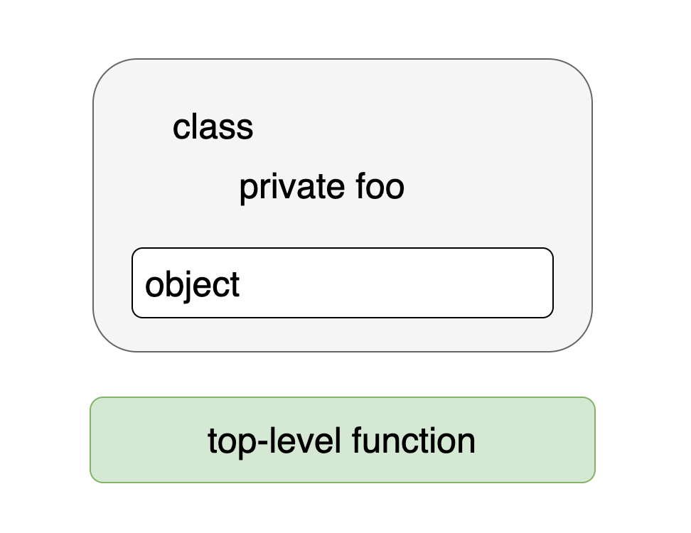

# 4. 클래스, 객체, 인터페이스   
## 4.1 클래스 계층 정의 
### 4.1.1 인터페이스 

#### 인터페이스 선언 

```kotlin
interface Clickable {
    fun click()
}
```

click 이라는 추상 메서드가 있는 간단한 인터페이스를 선언했다. 

<br />    

#### 인터페이스 구현   

```kotlin
class Button : Clickable {
    override fun click() = println("I was cliked")
}
```

자바에서 `extends`와 `implements` 키워드를 사용하지만 코틀린에서는 클래스 이름 뒤에 콜론(`:`)을 붙이고 인터페이스와 클래스 이름을 적는 것으로 클래스 확장과 인터페이스 구현을 모두 처리한다.


* 자바와 동일하게 여러 개의 인터페이스 구현 가능, 클래스는 한 개만 상속 가능   
* `override` 수식어: 인터페이스나 상위 클래스의 메서드, 프로퍼티 재정의시 꼭 사용해야 한다.

> 자바와 달리 코틀린에서는 override 변경자를 꼭 사용해야 한다.   
> 실수로 상위 클래스 메서드를 오버라이드하는 경우를 방지해준다.     

<br />

#### 디폴트 메서드 
```kotlin
interface Clickable {
    fun click() // 일반 메서드 선언 
    fun showOff() = println("I'm clickable!") // 디폴트 구현이 있는 메서드 
}
```

<br />

#### 동일한 메서드를 구현하는 다른 인터페이스 정의 
상황) 클래스가 구현하는 두 상위 인터페이스에 `showOff()` 라는 동일한 이름의 메서드가 있다.   

어느 쪽 showOff 메서드가 선택될까? 어느 쪽도 선택되지 않는다.   
showOff 구현을 대체할 오버라이딩 메서드를 직접 제공하지 않으면 다음과 같은 컴파일 오류가 발생한다.   

```kotlin
The class 'Button' must 
override public open fun showOff() because it inherits
many implementations of it.
```
 

다음은 상속한 인터페이스의 메서드 구현을 호출하는 코드이다.  

```kotlin
class Button : Clickable, Focusable {
    override fun click() = println("I was clicked") 
    
    // 애매모호함을 없애기 위해 재정의함. 
    // 이름과 시그니처가 같은 멤버 메서드에 대해 둘 이상의 디폴트 구현이 있는 경우  
    // 인터페이스를 구현하는 하위 클래스에서 명시적으로 새로운 구현을 제공해야 한다. 
    override fun showOff() {
        // super<타입>으로 사용할 상위 타입 지정 
        super<Clickable>.showOff()
    }
} 
```

Button 클래스는 두 인터페이스를 구현한다.   
Button은 상속한 두 상위 타입의 `showOff()` 메서드를 호출하는 방식으로 showOff를 구현한다.   
상위 타입의 구현을 호출할 때 자바와 동일하게 `super`를 사용한다.    

> 코틀린의 디폴트 메서드는 자바의 정적 메서드로 구현 ﴾코틀린은 자바 1.6과 호환﴿  

<br />  
<br />  

### 4.1.2 open, final, abstract 변경자: 기본적으로 final 
자바에서는 final로 명시적으로 상속을 금지하지 않는 모든 클래스를 다른 클래스가 상속할 수 있다.   

기본적으로 상속이 가능하면 편리하겠지만 문제 생기는 경우도 많다.   

**취약한 기반 클래스**    
하위 클래스가 기반 클래스에 대해 가졌던 가정이 기반 클래스를 변경함으로써 깨져버리는 경우에 생긴다.

🌟 코틀린의 클래스와 메서드는 기본적으로 final이다. 

어떤 클래스의 상속을 허용하려면 클래스 앞에 `open` 변경자를 붙여야 한다.    
오버라이드를 허용하고 싶은 메서드나 프로퍼티의 앞에도 `open` 변경자를 붙여야 한다.   

<br />   

```kotlin
// 이 클래스는 열러있다. 다른 클래스가 상속할 수 있다.
open class RichButton : Clickable {
  
    // final 메서드  
    fun disable() {} 
  
    // 하위 클래스에서 이 메서드를 오버라이드할 수 있다. 
    open fun animate() {} 
  
    // 이 메서드는 (상위 클래스에서 선언된) 열려있는 메서드를 오버라이드한다. 
    // 오버라이드한 메서드는 기본적으로 열려있다. 
    override fun click() {} 
}
```

클래스나 인터페이스의 멤버를 오버라이드하는 경우 그 메서드는 기본적으로 열려있다.     
하위 클래스에서 오버라이드하지 못하게 금지하려면 `final override` 처럼 final을 명시해야 한다.     

<br />   

> <열린 클래스와 스마트 캐스트>  
> 클래스의 기본적인 상속 기능 상태를 final로 함으로써 얻을 수 있는 큰 이익은 다양한 경우에 스마트 캐스트가 가능하다는 점이다.    
> 스마트 캐스트는 타입 검사 뒤에 변경될 수 없는 변수에만 적용 가능하다.   
> 클래스 프로퍼티의 경우 val 이면서 커스텀 접근자가 없는 경우에만 스마트 캐스트를 쓸 수 있다는 의미이다.   
> 또한 프로퍼티가 final 이어야만 한다는 뜻이기도 하다.   
> 프로퍼티가 final이 아니라면 그 프로퍼티를 다른 클래스가 상속하면서 커스텀 접근자를 정의함으로써 스마트 캐스트의 요구 사항을 깰 수 있다.   

<br />


#### 추상 클래스 정의 
```kotlin
abstract class Animated {
  
    // 추상 함수 
    // 이 함수에는 구현이 없다. 
    // 하위 클래스에서 이 함수를 반드시 오버라이드해야 한다. 
    abstract fun animated()
    
    // 추상 클래스에 속했더라도 비추상 함수는 기본적으로 final 이다. 
    // 원하면 open 으로 오버라이드를 허용할 수 있다. 
    open fun stopAnimating() {}
    
    fun animateTwice() {}
    
}
```

<br />

#### 코틀린 상속 제어 변경자 

| 변경자 | 이 변경자가 붙은 멤버는 | 설명                                                                 |      
|---|---|--------------------------------------------------------------------|  
| final   | 오버라이드 가능| 클래스 멤버의 기본 변경자                                                     |  
| open    | 오버라이드 가능| 반드시 open을 명시해야 오버라이드할 수 있다.                                        |  
| abstract | 반드시 오버라이드해야 함| 추상 클래스의 멤버에만 이 변경자를 붙일 수 있다. <br /> 추상 멤버에는 구현이 있으면 안 된다.          |  
| override | 상위 클래스나 상위 인스턴스의 멤버를 오버라이드하는 중| 오버라이드하는 멤버는 기본적으로 열려있다. <br /> 하위 클래스의 오버라이드를 금지하려면 final을 명시해야 한다. |  

<br />
<br />

### 4.1.3 가시성 변경자: 기본적으로 공개 
가시성 변경자는 코드 기반에 있는 선언에 대한 클래스 외부 접근을 제어한다.   
어떤 클래스의 구현에 대한 접근을 **제한**함으로써 그 클래스에 의존하는 외부 코드를 깨지 않고도 클래스 내부 구현을 변경할 수 있다.   

<br />  

#### 코틀린의 internal  

* 코틀린은 아무 변경자도 없는 경우 선언은 모두 공개(public) 된다.   


* 자바의 기본 가시성인 패키지 전용(package-private)은 코틀린에 없다.   
코틀린은 패키지를 네임스페이스 관리 용도로만 사용한다. 


* 패키지 전용 가시성에 대한 대안으로 코틀린에서는 `internal` 이라는 새로운 가시성 변경자를 도입했다.   
    - internal: 모듈 내부에서만 볼 수 있음 이라는 뜻이다.     
    - 모듈: 한 번에 한꺼번에 컴파일되는 코틀린 파일들을 의미한다.  
    - 모듈 내부 가시성은 진정한 캡슐화를 제공한다는 장점이 있다.
    - 자바는 패키지가 같은 클래스를 선언하기만 하면 접근이 가능해 모듈의 캡슐화가 쉽게 깨진다.   


* 코틀린에서는 최상위 선언에 대해 private 가시성을 허용한다.

<br />   

#### 코틀린의 가시성 변경자 

| 변경자             | 클래스 멤버              | 최상위 선언             |    
|:-----------------|:---------------------|:--------------------|   
| public (기본 가시성) | 모든 곳에서 볼 수 있다.      | 모든 곳에서 볼 수 있다.     |  
| internal        | 같은 모듈 안에서 볼 수 있다.   | 같은 모듈 안에서만 볼 수 있다. |
| protected       | 하위 클래스 안에서만 볼 수 있다. | (최상위 선언에 적용할 수 없음) |
| private         | 같은 클래스 안에서만 볼 수 있다. | 같은 파일 안에서만 볼 수 있다. |

<br />

```kotlin
internal open class TalkativeButton : Focusable {
    private fun yell() = println("Hey!")
    protected fun whisper() = println("Let's talk!")
}

// 오류 : "public" 멤버가 자신의 "internal" 수신 타입인 "TalkativeButton"을 노출함 
fun TalkativeButton.giveSpeech() {
    // 오류 : "yell"에 접근할 수 없음. 
    // "TalkativeButton"의 private 멤버이다. 
    yell()
  
    // 오류 : "whisper"에 접근할 수 없음.
    // "TalkativeButton"의 protected 멤버이다. 
    whisper() 
}
```


코틀린은 public 함수인 giveSpeech 안에서 그보다 가시성이 더 낮은 타입은 TalkativeButton을 참조하지 못하게 한다.    


* 어떤 클래스의 기반 타입 목록에 들어있는 타입이나 제네릭 클래스의 타입 파라미터에 들어있는 타입의 가시성은 그 클래스 자신의 가시성과 같거나 높아야 한다.


* 메서드의 시그니처에 사용된 모든 타입의 가시성은 그 메서드의 가시성과 같거나 더 높아야 한다.


위 규칙은 어떤 함수를 호출하거나 어떤 클래스를 확장할 때 필요한 모든 타입에 접근할 수 있게 보장해준다.  


<br />

#### 컴파일 오류 없애는 방법 
* giveSpeech 확장 함수의 가시성을 internal로 바꾸기 
  
* TalkativeButton 클래스의 가시성을 public 으로 바꾸기 

<br />

#### 코틀린의 protected 
* 자바에서는 같은 패키지 안에서 protected 멤버에 접근할 수 있지만, 코틀린에서는 그렇지 않다는 점에서     
자바와 코틀린의 protected가 다르다는 사실에 유의해야 한다.   

* protected 멤버는 오직 어떤 클래스나 그 클래스를 상속한 클래스 안에서만 보인다. 

<br />


> **코틀린의 가시성 변경자와 자바**   
> 코틀린의 public, protected, private 변경자는 컴파일된 자바 바이트코드 안에서도 그대로 유지된다.    
> 유일한 예외는 private 이다.   
> 자바에서 클래스를 private으로 만들 수 없으므로 내부적으로 코틀린은 private 클래스를 package-private 클래스로 컴파일한다.   
> 
> 그렇다면 internal 변경자는 어떻게 처리될까?  
> package-private 가시성은 internal 과는 전혀 다르다.     
> 모듈은 보통 여러 패키지로 이뤄지며 서로 다른 모듈에 같은 패키지에 속한 선언이 들어있을 수도 있다.   
> 따라서 internal 변경자는 바이트코드상에서는 public 이 된다.   


<br /> 

코틀린과 자바 가시성 규칙의 또 다른 차이는 코틀린에서는 외부 클래스가 내부 클래스나 중첩된 클래스의 private 멤버에 접근할 수 없다는 점이다.   

<br />
<br />

### 4.1.4 내부 클래스와 중첩된 클래스: 기본적으로 중첩 클래스 
코틀린의 중첩 클래스는 명시적으로 요청하지 않는 한 바깥쪽 클래스 인스턴스에 대한 접근 권한이 없다는 점이다.   
<br />

#### 예제: View 요소를 하나 만들어보자. 
* View 상태를 직렬화해야 한다. 

* 직렬화할 수 있는 상태가 있는 뷰 선언 

```kotlin
interface State: Serializable

interface View {
    fun getCurrentState() : State
    fun restoreState(state: State) {}
}
```

* 자바에서 내부 클래스를 사용해 View 구현하기 


```kotlin
/* 자바 */
public class Button implements View {
    @Override 
    public State getCurrentState() {
        return new ButtonState();
    }

    @Override
    public void restoreStore(State state) { /*...*/ }

    public class ButtonState implements State { /*...*/ }
} 
```


State 인터페이스를 구현한 ButtonState 클래스를 정의해서 Button에 대한 구체적인 정보를 저장한다.   
getCurrentState 메서드 안에서는 ButtonState의 새 인스턴스를 만든다.   
실제로는 ButtonState 안에 필요한 모든 정보를 추가해야 한다.   

위에서 선언한 버튼의 상태를 직렬화하면 다음과 같은 오류가 발생한다.   

```
java.io.NotSeializableException: Button
```

자바에서 다른 클래스 안에 정의한 클래스는 자동으로 내부 클래스가 된다.   
이 예제의 ButtonState 클래스는 바깥쪽 Button 클래스에 대한 참조를 묵시적으로 포함한다.   
그 참조로 인해 ButtonState를 직렬화할 수 없다.   
Button을 직렬화할 수 없으므로 버튼에 대한 참조가 ButtonState의 직렬화를 방해한다.      
<br />                 
 
* 중첩 클래스를 사용해 코틀린에서 View 구현 

```kotlin 
class Button : View {
    override fun getCurrentState() : State = ButtonState()

    override fun restoreState(state: State) { /*...*/ }

    class ButtonState : State { /*...*/ } // 이 클래스는 자바의 정적 중첩 클래스와 대응한다. 
}
```


코틀린 중첩 클래스에 아무런 변경자가 붙지 않으면 자바 static 중첩 클래스와 같다.   
이를 내부 클래스로 변경해서 바깥쪽 클래스에 대한 참조를 포함하게 만들고 싶다면 `inner` 변경자를 붙여야 한다. 
<br />            

|클래스 B 안에 정의된 클래스 A|자바에서는|코틀린에서는|
|:---|:---|:---|
|중첩 클래스(바깥쪽 클래스에 대한 참조를 저장하지 않음)|`static class A`|`class A`|
|내부 클래스(바깥쪽 클래스에 대한 참조를 저장함)|`class A`|`inner class A`|


<br />
 
* 내부 클래스 Inner 안에서 바깥쪽 클래스 Outer의 참조에 접근하려면 `this@Outer` 라고 써야 한다. 


```kotlin 
class Outer {
    inner class Inner {
        fun getOuterReference(): Outer = this@Outer 
    }

}
```


<br />
<br />

### 4.1.5 봉인된 클래스: 클래스 계층 정의 시 계층 확장 제한  

#### 인터페이스 구현을 통해 식 표현 


```kotlin 
interface Expr

class Num(val value: Int) : Expr

class Sum(val left: Expr, val right: Expr) : Expr

fun eval(e: Expr) : Int = 
    when (e) {
        is Num -> e.value 
        is Sum -> eval(e.right) + eval(e.left)
        else -> 
            throw IllegalArgumentException("Unknown expression")
    }
```


* 코틀린은 when 사용 시 항상 디폴트 분기인 else 분기를 덧붙여야 한다.   

* 디폴트 분기가 있으면 새로운 하위 클래스를 추가하더라도 컴파일러가 when이 모든 경우를 처리하는지 제대로 검사할 수 없다.   

* 실수로 새로운 클래스 처리를 잊어버렸더라도 디폴트 분기가 선택되기 때문에 심각한 버그가 발생할 수도 있다.   


<br />

#### sealed 클래스로 식 표현하기 

```kotlin 
sealed class Expr {
    class Num(val value: Int) : Expr() // 기반 클래스를 sealed로 봉인한다. 
 
    class Sum(val left: Expr, val right: Expr) : Expr() // 기반 클래스의 모든 하위 클래스를 중첩 클래스로 나열한다. 
}

/*
when 식이 모든 하위 클래스를 검사하므로 
별도의 else 분기가 없어도 된다. 
*/
fun eval(e: Expr) : Int = 
    when (e) {
        is Expr.Num -> e.value 
        is Expr.Sum -> eval(e.right) + eval(e.left)
    }
```


* when 식에서 sealed 클래스의 모든 하위 클래스를 처리한다면 디폴트 분기가 필요 없다.   

* sealed로 표시된 클래스는 자동으로 open 이다. 

* 나중에 sealed 클래스의 상속 계층에 새로운 하위 클래스를 추가해도 when 식이 컴파일되지 않는다.       
  즉 when 식을 고쳐야 한다는 사실을 쉽게 알 수 있다.   


* 내부적으로 Expr 클래스는 private 생성자를 가진다.      
👉🏻 그 생성자는 클래스 내부에서만 호출 가능     
👉🏻 sealed 인터페이스 정의 못함.       
👉🏻 봉인된 인터페이스를 만들 수 있다면 코틀린 컴파일러에게 그 인터페이스를 자바 쪽에서 구현하지 못하게 막을 수 있는 수단이 없다.   

<br />

> 코틀린 1.5 부터 봉인된 클래스가 정의된 패키지 안의 아무 위치에 선언할 수 있게 됐고,   
> 봉인된 인터페이스도 추가되었다. 


<br />
<br />

## 4.2 뻔하지 않은 생성자와 프로퍼티를 갖는 클래스 선언 

* 코틀린은 주 생성자와 부 생성자를 구분한다.       
    - 주 생성자: 클래스를 초기화할 때 주로 사용, 클래스 본문 밖에 정의 
    - 부 생성자: 클래스 본문 안에서 정의

* 코틀린에서는 초기화 블록을 통해 초기화 로직을 추가할 수 있다.   

<br />

### 4.2.1 클래스 초기화: 주 생성자와 초기화 블록 

```kotlin 
class User(val nickname: String)
```

클래스 이름 뒤에 오는 괄호로 둘러싸인 코드를 주 생성자라고 부른다. 

<br />            


```kotlin 
class User constructor(_nickname: String) { // 파라미터 하나만 있는 주 생성자
    val nickname: String

    // 초기화 블록
    init {
        nickname = _nickname
    }
}
```

<br />


* `constructor` : 주 생성자나 부 생성자 정의를 시작할 때 사용
  주 생성자 앞에 별다른 어노테이션이나 가시성 변경자가 없다면 생략 가능   

* `init` : 초기화 블록을 시작할 때 사용
 

* `_` : 프로퍼티와 생성자 파라미터를 구분함.  


```kotlin 
class User(_nickname: String) {
    val nickname = _nickname
}
```

<br />


주 생성자의 파라미터로 프로퍼티를 초기화한다면 그 주 생성자 파라미터 이름 앞에 val을 추가하는 방식으로 프로퍼티 정의와 초기화를 쓸 수 있다. 


```kotlin 
class User(val nickname: String) // val은 이 파라미터에 상응하는 프로퍼티가 생성된다는 뜻이다. 
```


<br />

함수 파라미터와 마찬가지로 생성자 파라미터에도 디폴트 값을 정의할 수 있다. 

```kotlin 
// 생성자 파라미터에 대한 디폴트 값을 제공 
class User(val nickname; String, val isSubscribed: boolean = true)
```

<br />

클래스의 인스턴스를 만들려면 new 키워드 없이 생성자를 직접 호출하면 된다.   

```kotlin 
// ex. 디폴트 값 사용 
val hyerin = User("혜린")

// ex. 생성자 인자 중 일부에 대해 이름 지정 가능 
val hyerin = User("혜린", isSubscribed = false)

// ex. 모든 인자를 파라미터 선언 순서대로 지정 가능 
val hyerin = User("혜린", false)
```

<br />

클래스에 기반 클래스가 있다면 주 생성자에서 기반 클래스의 생성자를 호출해야 할 필요가 있다.   
기반 클래스를 초기화하려면 기반 클래스 이름 뒤에 괄호를 치고 생성자 인자를 넘긴다.   

```kotlin 
open class User(val nickname: String) { ... }
class TwitterUser(nickname: String) : User(nickname) { ... }
```

<br />

클래스를 정의할 때 별도로 생성자를 정의하지 않으면 컴파일러가 자동으로 아무 일도 하지 않는, 인자가 없는 디폳트 생서자를 만들어준다.   

```kotlin 
open class Button // 인자가 없는 디폴트 생성자가 만들어진다. 
```

<br />

* Button의 생성자는 아무 인자도 받지 않지만, Button 클래스를 상속한 하위 클래스는 반드시 Button 클래스의 생성자를 호출해야 한다.  

* 위 규칙으로 인해 기반 클래스의 이름 뒤에 꼭 빈 괄호가 들어간다. 

* 인터페이스는 생성자가 없기 때문에 어떤 클래스가 인터페이스를 구현하는 경우 인터페이스 이름 뒤에는 아무 괄호도 없다. 
  
* 이름 뒤 괄호가 있는지에 따라 기반 클래스와 인터페이스를 구별할 수 있다.

```kotlin 
class RadioButton : Button()
```

<br />

Secretive 클래스 안에 주 생성자밖에 없고 그 주 생성자는 비공개이므로 외부에서는 Secretive를 인스턴스화할 수 없다.   


```kotlin
class Secretive private constructor() {} // 이 클래스의 주 생성자는 비공개이다.
```

<br />

> **비공개 생성자에 대한 대안**   
> 유틸리티 함수 제공 클래스, 싱글턴 등의 경우 자바에서는 private 생성자를 정의해서 다른 곳에서의 인스턴스화를 막는다.   
> 코틀린은 이런 경우 언에서 기본 지원한다.   
> 정적 유틸리티 함수 대신 최상위 함수를 사용할 수 있고 싱글턴을 사용하고 싶으면 객체를 선언하면 된다.   


<br />
<br />

### 4.2.2 부 생성자: 상위 클래스를 다른 방식으로 초기화        
자바에서 오버로드한 생성자가 필요한 상황 중 상당수는 코틀린의 디폴트 파라미터 값과 이름 붙인 인자 문법을 사용해 해결할 수 있다.   

<br /> 

#### 🍿 Tip!  
인자에 대한 디폴트 값을 제공하기 위해 부 생성자를 여럿 만들지 말라.   
대신 파라미터의 디폴트 값을 생성자 시그니처에 직접 명시하라.   

<br /> 

프레임워크 클래스를 확장해야 하는데 여러 가지 방법으로 인스턴스를 초기화할 수 있게 다양한 생성자를 지원해야 하는 경우가 있다.   


#### 자바에서 선언된 생성자가 2개인 View 클래스 

* 부 생성자는 `constructor` 키워드로 시작하고 필요에 따라 많이 선언해도 된다.   

* 부 생성자는 `super()` 키워드를 통해 자신에 대응하는 상위 클래스 생성자를 호출한다.   


```kotlin 
/* 부 생성자들 */
open class View {
    constructor(ctx: Context) {
        // code
    }

    constructor(ctx: Context, attr: AttributeSet) {
        // code 
    }
}

/* 상위 클래스의 생성자를 호출 */
class MyButton : View {
    constructor(ctx: Context)  
         : super(ctx) {
            // ...
         }

    constructor(ctx: Context, attr: AttributeSet)
        : super(ctx, attr) {
            // ...
        }
}
```



<br /> 

자바처럼 `this()` 를 통해 클래스 자신의 다른 생성자를 호출할 수 있다. 

```kotlin 
class MyButton : View {
    constructor(ctx: Context): this(ctx, MY_STYLE) { // 이 클래스의 다른 생성자에게 위임한다.
        // ...
    } 
    
    constructor(ctx: Context, attr: AttributeSet): super(ctx, attr) {
        // ...
    }
}
```


* 클래스에 주 생성자가 없다면 모든 부 생성자는 반드시 상위 클래스를 초기화하거나 다른 생성자에게 생성을 위힘해야 한다.   


