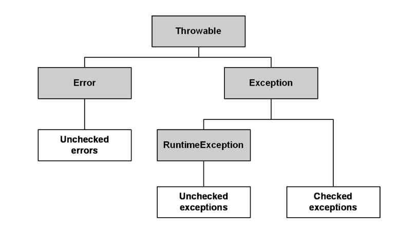

# Null 안정성
## 1. 널 참조의 위험성 
* 자바에서 NPE를 줄이기 위해 JDK8에서 `Optional`을 지원하기 시작했다.
* 자바의 옵셔널은 값을 래핑하기 때문에 객체 생성에 따른 오버헤드가 발생하고, 컴파일 단계에서 Null 가능성을 검사하지 않음

<br />

## 2. 코틀린에서 NPE를 해결하는 다양한 방법 
* 코틀린은 언어적 차원에서 NPE가 발생할 가능성을 제거한다.


* 코틀린의 타입은 기본적으로 `Non-Null` 타입이므로 null을 허용하지 않는다.


* 코틀린은 null을 허용하는 `Nullable` 타입을 제공한다.


* Nullable 참조는 컴파일 단계에서 널 안정성을 제공한다. 


* Nullable 참조에 대한 접근은 안전 연산자 사용
    - `a?.length` safe-call 연산자   

    
* 엘비스 연산자를 사용해 null이 아닌 경우 특정 값을 사용하도록 한다.

```kotlin
val b : Int = if (a != null) a.length else 0

// 엘비스 연산자를 사용하면 좌변이 null인 경우 우변을 리턴한다.
val b = a?.length ?: 0
```

<br />

## 3. 코틀린에서도 NPE가 발생할 수 있다.

* 명시적 NPE 호출

```kotlin
throw NullPointerException() 
```


* !! NotNull 임을 단언하는 단언 연산자를 사용 

```kotlin
val c: String? = null 
val d = c!!.length
```


* 자바와 상호운용하는 경우 자바에서 NPE를 유발하는 코드를 코틀린에서 사용하면 NPE가 발생할 수 있다. 

```kotlin
println(Java_NullSafety.getNullStr().length)
// Exception in thread "main" java.lang.NullPointerException
```


* 코틀린에서 자바 코드를 사용할 때 항상 Nullable 가능성을 염두해 안전 연산자와 엘비스 연산자를 사용 

```kotlin
println(Java_NullSafety.getNullStr()?.length)
```

<br />
<br />


# 예외처리 
* 코틀린의 모든 예외 클래스는 최상위 예외 클래스인 `Throwable`을 상속한다.   
 


* Exception: 시스템에서 포착 가능(`try-catch`) 복구 가능, 예외 처리 강제 
    - IOException, FileNotFoundException, ...
    - `@Transactional`에서 해당 예외가 발생하면 기본적으로 롤백이 동작하지 않음 
        + rollbackFor를 사용해야 한다. 
        

* RuntimeException: 런타임시 발생하는 예외, 예외 처리를 강제하지 않음 
    - NullPointerException, ArrayIndexOutOfBoundsException, ...


* 코틀린에서는 자바의 Exception 계층을 코틀린 패키지로 래핑한다. 


* 자바에서 체크드 익셉션은 컴파일 에러가 발생하기 때문에 무조건 `try-catch` 로 감싸거나 `throws` 로 예외를 전파해야 한다. 


* 코틀린은 체크드 익셉션을 강제하지 않는다. 
    - `Thread.sleep(1);` → 코틀린에서 컴파일 오류가 발생하지 않는다. 


* 코틀린의 `try-catch`는 표현식이다. 
    - `val a = try { "1234".toInt() } catch (e: NumberFormatException) { println("catch ") }`
  

* 코틀린에서 Exception을 발생시키려면 `throw`를 사용한다. 
    - `throw Exception("예외 발생")`


    
* throw도 표현식이기 때문에 throw를 리턴할 수 있다. 


* `Nothing` 타입을 사용하면 컴파일러는 해당 코드 이후는 실행되지 않는다는 경고를 보여준다. 


* 엘비스 연산자와 사용하면 null 안전 코드를 작성하지 않아도 된다. 


<br /> 

# 상속 
## 1. 자바의 상속 
* 객체지향 핵심 원칙 중 하나인 상속은 상속을 통해 기존 코드를 재사용하거나 확장할 수 있다. 
* 자바는 기본적으로 모든 클래스가 상속이 가능하나 상속에 따른 부작용이 발생할 경우를 대비해 `final` 키워드로 막을 수 있다. 
* 상속을 목적으로 만든 클래스가 아니라면 모두 final로 작성하는 것이 좋다. 

<br />

## 2. 코틀린의 상속
* 자바의 모든 클래스의 조상: `Object`


* 코틀린에서 모든 클래스의 조상: `Any`


* Any에는 equals, hashCode, toString이 존재하고 모든 클래스로 자동 상속된다. 


* 코틀린의 클래스는 기본적으로 final 클래스와 같이 상속을 막고 꼭 필요한 경우 `open` 키워드로 상속을 허용할 수 있다. 


* 함수나 프로퍼티를 재정의할 때도 `open` 키워드로 오버라이드에 대해 허용해야 한다.


* `override`된 함수나 프로퍼티는 기본적으로 open 되어 있으므로 하위 클래스에서 오버라이드를 막기 위해서 final을 앞에 붙인다. 


* 하위 클래스에서 상위 클래스의 함수나 프로퍼티를 접근할 때 `super` 키워드를 사용한다. 


